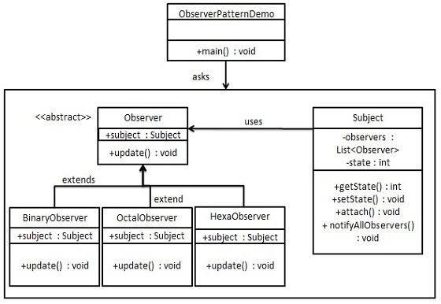

# 介绍
## 意图
定义对象间的一种一对多依赖关系,当一个对象的状态发生改变时,所有依赖它的对象得到通知并自动更新

## 主要解决
一个对象的状态发生改变,所有依赖对象(观察者)都将得到通知,进行广播通知

## 关键
在一个抽象类里有一个ArrayList存放观察者们

## 使用场景
1.一个抽象模型有两个方面，其中一个方面依赖于另一个方面。将这些方面封装在独立的对象中使它们可以各自独立地改变和复用
2.一个对象的改变将导致其他一个或多个对象也发生改变，而不知道具体有多少对象将发生改变，可以降低对象之间的耦合度。
3.一个对象必须通知其他对象，而并不知道这些对象是谁。
4.需要在系统中创建一个触发链，A对象的行为将影响B对象，B对象的行为将影响C对象……，可以使用观察者模式创建一种链式触发机制。

## 注意事项： 
1、JAVA 中已经有了对观察者模式的支持类。 
2、避免循环引用。 
3、如果顺序执行，某一观察者错误会导致系统卡壳，一般采用异步方式。

## 实现
