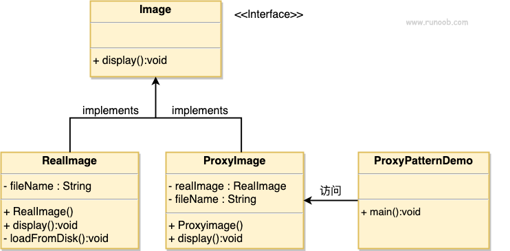

# 介绍

## 意图

为其他对象提供一种代理以控制对这个对象的访问

## 主要解决

在直接访问对象时带来的问题

## 何时使用

增加中间层

# 实现
我们将创建一个 Image 接口和实现了 Image 接口的实体类。ProxyImage 是一个代理类，减少 RealImage 对象加载的内存占用。

ProxyPatternDemo 类使用 ProxyImage 来获取要加载的 Image 对象，并按照需求进行显示

